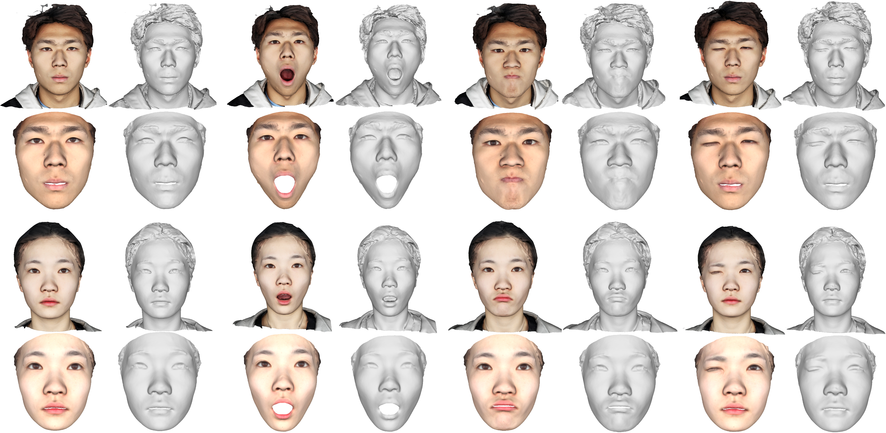

# FaceVerse-High Quality 3D Face Dataset 
### FaceVerse: a Fine-grained and Detail-changeable 3D Neural Face Model from a Hybrid Dataset
Lizhen Wang, Zhiyuan Chen, Tao Yu, Chenguang Ma, Liang Li, Yebin Liu  CVPR 2022

[[Code]](https://github.com/LizhenWangT/FaceVerse)



NOTE: For privacy protection, please blur the eyes if the images or the models appear in any materials that will be published (such as paper, video, poster, etc.)

### Agreement
1. The FaceVerse dataset (the "Dataset") is available for **non-commercial** research purposes only. Any other use, in particular any use for commercial purposes, is prohibited. This includes, without limitation, incorporation in a commercial product, use in a commercial service, as training data for a commercial product, for commercial ergonomic analysis (e.g. product design, architectural design, etc.), or production of other artifacts for commercial purposes including, for example, web services, movies, television programs, mobile applications, or video games. The dataset may not be used for pornographic purposes or to generate pornographic material whether commercial or not. The Dataset may not be reproduced, modified and/or made available in any form to any third party without Tsinghua University’s prior written permission.

2. You agree **not to** reproduce, modified, duplicate, copy, sell, trade, resell or exploit any portion of the images and any portion of derived data in any form to any third party without Tsinghua University’s prior written permission.

3. You agree **not to** further copy, publish or distribute any portion of the Dataset. Except, for internal use at a single site within the same organization it is allowed to make copies of the dataset.

4. Tsinghua University reserves the right to terminate your access to the Dataset at any time.


### Download Instructions 
The dataset is encrypted to prevent unauthorized access.

Please fill the [request form](./FaceVerse_Agreement.pdf) and send it to Yebin Liu (liuyebin@mail.tsinghua.edu.cn) and cc Lizhen Wang (wlz18@mails.tsinghua.edu.cn) to request the download link. The agreement should be signed by **a full-time academic staff member** (not a student) and sent through your academic email.

By requesting for the link, you acknowledge that you have read the agreement, understand it, and agree to be bound by them. If you do not agree with these terms and conditions, you must not download and/or use the Dataset.


### Data Explanation
FaceVerse-High Quality 3D Face Dataset contains 2,688 high-quality head scans (21 expressions from 128 identities) captured by a dense DLSR rig.
For each scan, we provide the 3D model (.obj), the corresponding texture map (.jpeg) and the FaceVerse fitted model (.ply) with the same topology.

NOTE: For privacy protection, we only release the high quality dataset and the large scale coarse dataset will not be released.

### Citation
If you use this dataset for your research, please consider citing:
```
@InProceedings{wang2022faceverse,
title={FaceVerse: a Fine-grained and Detail-changeable 3D Neural Face Model from a Hybrid Dataset},
author={Wang, Lizhen and Chen, Zhiyua and Yu, Tao and Ma, Chenguang and Li, Liang and Liu, Yebin},
booktitle={IEEE Conference on Computer Vision and Pattern Recognition (CVPR2022)},
month={June},
year={2022},
}
```

### Contact
- Lizhen Wang [(wlz18@mails.tsinghua.edu.cn)](wlz18@mails.tsinghua.edu.cn)
- Yebin Liu [(liuyebin@mail.tsinghua.edu.cn)](mailto:liuyebin@mail.tsinghua.edu.cn)
